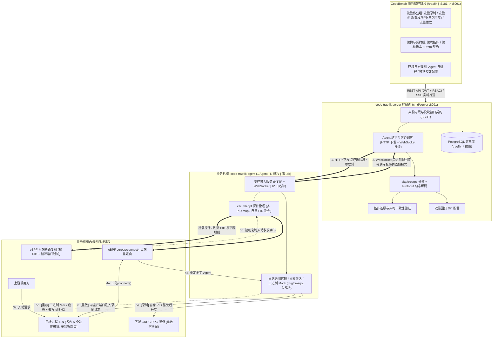
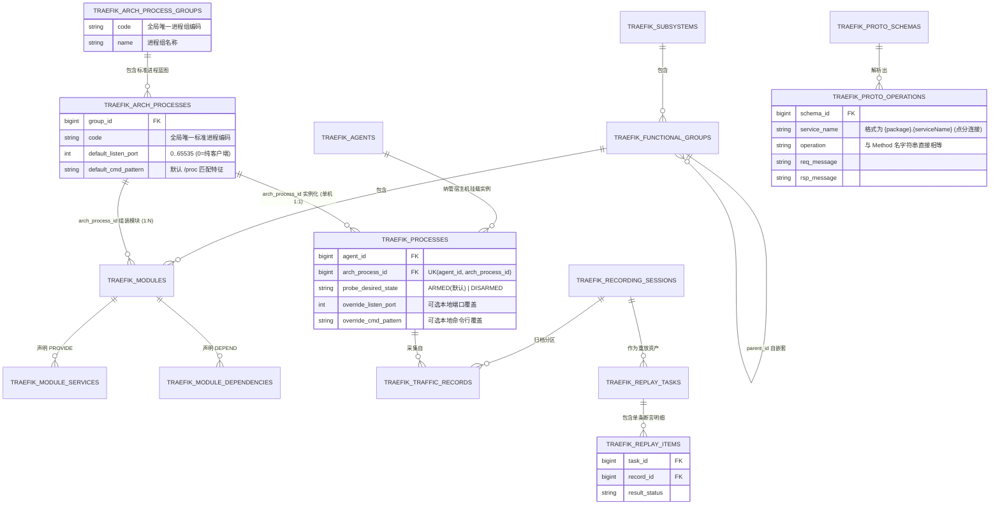

# 业务流量监控与重放 (`code-traefik`) 特性清单与需求范围界定规范 (Feature Matrix & Scope)

- **文档编号**：`01-feature-matrix.md`
- **文档版本**：v2.9.1
- **更新日期**：2026-11-02
- **当前阶段**：阶段一：特性清单与边界明确
- **状态**：已批准待实施 (Approved for M10)
- **协议依据**：详见项目内置参考文档 [`docs/07-references/01-cros-rpc-protocol-spec.md`](../07-references/01-cros-rpc-protocol-spec.md)（文档编号：`01-cros-rpc-protocol-spec.md` v1.0.0，基于 DOPHI 平台 `cros_rpccore.ph` / `cros_rpctcp` 规范，本文所有字段名、偏移与取值均以该规范原文为准）

### 修订记录

| 版本 | 日期 | 修订要点 |
| :--- | :--- | :--- |
| v2.0.0 | 2026-10-27 | 重构为主控 + Agent 分离、架构拓扑驱动模型 |
| v2.1.0 | 2026-10-27 | 按 CROS RPC 协议规范收敛协议边界 |
| v2.2.0 | 2026-10-28 | 剥离 Agent 侧 `.pb` 依赖，收敛为纯二进制收集与重放 |
| v2.3.0 | 2026-10-28 | 支持单 Agent 多进程并发监控与任务级协同录制 |
| v2.4.0 | 2026-10-28 | 明确架构元素 SSOT、三级模型、模块级接口契约与多模块进程映射 |
| v2.5.0 | 2026-10-28 | 依据阶段一出口检视修订：新增「关键业务假设」；补充入站旁路采集与长连接前置条件；新增 Agent 实例纳管；PROVIDE 全局唯一与来源模块判定规则；重放结果状态与 Mock 未命中策略；`.pb` 版本管理；信道收敛为 HTTP + WebSocket；重排 P0/P1/P2；补充性能、存储保留与 eBPF 测试策略 NFR；补充术语表 |
| v2.5.1 | 2026-10-29 | 挂载项目内置协议规范 (docs/07-references/01-cros-rpc-protocol-spec.md)；明确服务名映射为 package 前缀全名 ({package}-{serviceName}，package 保持原有点分结构，以中划线连接)；依据协议原文固化 F-13 应答头回填字段清单 (ullSNO/aucTraceBuff/ullClientSendTime) 与精准偏移 |
| v2.6.0 | 2026-10-29 | 增补多人并发与双模持久化规范：Agent 与录制素材均划分公共级 (`SHARED`) 与个人级 (`PRIVATE`)，普通用户可自建自用私有 Agent（共享公共架构元素 SSOT）；确立 Agent 动态排他租约 (`Mutex Lease`，同 Agent 同时间仅 1 名用户操作，冲突返回 `409`)；支持有权限的录制素材在相同架构元素的进程间跨 Agent 重放；明确 `traefik_traffic_records` 采用 `raw_req_packet` / `raw_rsp_packet` (`bytea`) + `payload_json` (`jsonb`) 双模往返存储与双轨分发管道 |
| v2.7.0 | 2026-10-29 | 依据架构检视与用户批复修订：1. 明确管理员特权（`traefik_admin` 可穿透查看/审计所有 `PRIVATE` 素材与 Agent，普通用户严格防横向越权）；2. 明确共享环境（`SHARED` Agent）排他重放支持；3. 主控直接连接 Agent（内网互通）；4. 数据库表数量放开，规范化拆解为 13 张核心物理表（新增 `traefik_process_modules` 关联表与 `traefik_replay_items` 重放条目表）并引入 PostgreSQL 原生范围物理分区（`PARTITION BY RANGE (created_at)`）；5. 架构一致性验证结果扩充 `Not Monitored` 分类 |
| v2.8.0 | 2026-11-01 | 依据 M8 控制台信息架构重组修订（详见 ADR-07）：1. 菜单按操作频次重构为「`流量作业`（`流量录制` / `流量调试` / `流量重放`）➔ `架构与契约`（`架构拓扑` / `架构元素` / `Proto 契约`）➔ `环境与治理`（`Agent 与进程` / `模块参数配置`）」3 组 8 项，默认落地 `/record` 并无损兼容旧深链重定向；2. 拆分 `流量录制`（批次资产台账与跨页流转，`F-15.1`）与 `流量调试`（异常过滤、四段解剖、Trace 串联与单包快速重放调试闭环，`F-15.2`）；3. 剥离全屏 `架构拓扑` 与纯逻辑 `架构元素`，将物理业务进程（含进程分组 `group_name`）CRUD 唯一收口至 `Agent 与进程`（`F-15.3`）；4. 将基于 `.pb` 在线手填 JSON 主动组包发包调试归入 P2 演进项（`F-23`） |
| v2.9.0 | 2026-11-02 | 依据 M10 架构进程蓝图解耦与 eBPF 自动预挂待命设计修订（详见 ADR-08 / ADR-09）：1. **领域解耦**：在 `/architecture` 左树顶部引入 `[逻辑架构 \| 物理进程]` 切换器，新增 `traefik_arch_process_groups` 与 `traefik_arch_processes` 全局物理进程蓝图 SSOT（承载 `FM` 模块组装与默认端口/启动特征），`traefik_processes` 收敛为宿主机 Agent `1:1` 挂载实例（`UNIQUE(agent_id, arch_process_id)`）并支持本地覆盖；2. **eBPF 默认自动预挂 (`ARMED`)**：前置完成存量连接诊断与一次重连就绪，停录回退 `ARMED` 不断开长连接；3. **三台同构分组进程树**：`/architecture`、`/agents` 与 `/record` 共享统一的分组进程树交互（`F-15.3`~`F-15.5`） |
| v2.9.1 | 2026-11-02 | 依据 ADR-09 架构检视修订：1. **多公共环境对等建模**：明确 `1 台 Agent = 1 套独立运行环境`（允许多套 `SHARED` 公共测试环境与多套 `PRIVATE` 个人环境各自 `1:1` 挂载同一 `ArchProcess`），Agent 支持可选 `fallback_agent_id` 指向联调关联公共环境；2. **按需入站钩子与三态代理闸门**：`ARMED` 待命期不挂载高频读写 tracepoint（零读写拦截损耗），`EgressProxy` 支持 `PASSTHROUGH \| CAPTURING \| REPLAY_MOCK` 三态切换（重放期帧级 Mock 接管既有代理连接并拒绝 `NEED_RECONNECT` 进程重放，守护零外泄红线），卸挂与 5m 失联执行优雅排水；3. **统一 7 态探针枚举、点分服务名与新系统免迁移干净重建** |

---

## 1. 系统愿景与产品定位 (Vision & Positioning)

### 1.1 项目愿景
**业务流量监控与重放 (`code-traefik`)** 是挂载于 CodeBench 开发者综合工作台的业务子系统，**只服务于业务实际使用的 DOPHI `CROS RPC` 协议**（`24B 公共消息头 RPC_COMM_HEAD_S` + `会话头 RPC_REQ/RSP/MNG_HEAD_S` + `0..N 段扩展头` + `序列化 Payload`），不做任何其他协议扩展。

目标用户与痛点：

| 角色 | 痛点 | 本系统提供的能力 |
| :--- | :--- | :--- |
| 业务开发 / 测试工程师 | 联调与回归依赖完整下游环境，问题难以复现 | 录制一次真实业务任务，下游关闭后在测试环境离线重放并做字段级 Diff |
| 架构师 / 模块负责人 | 架构设计中的模块依赖与实际调用逐渐漂移，无从核对 | 维护三级架构元素与模块接口契约，用实测流量验证架构一致性 |
| 平台管理员 | 抓包工具需要业务进程改造或全机特权，风险大 | 每台机器 1 个零 Schema 依赖的 Agent，只作用于指定进程 |

系统采用 **「控制面主框架 (`code-traefik-server`) + 独立数据面代理 (`code-traefik-agent`)」同仓双二进制**架构：

1. **控制面 `code-traefik-server`**（保持在 `code-bench` 微前端家族内）：作为架构元素的单一真实源（SSOT，选型依据见 §2.2 与 Non-Goal 7），负责三级架构元素与接口契约建模、Agent 纳管、多进程协同录制编排、`.pb` 解码、架构一致性验证、重放编排与回归 Diff 报告。
2. **数据面 `code-traefik-agent`**（同仓 `cmd/agent`）：零前端、零数据库、零 `.pb` 依赖的守护进程，每台业务机器部署 1 个，同时监控本机多个目标进程（`1 Agent : N Processes`）；负责报文采集、原始二进制回传、本地重放注入、下游 Mock 与 `ullSNO` 自愈。

### 1.2 核心价值主张 (Core Value Propositions)
1. **单机多进程、零 Schema 的轻量 Agent**：同仓构建主控与 Agent；Agent 不感知 `.pb`，免除跨机同步 Schema 的负担。
2. **架构元素闭环与模块级一致性验证**：自主维护「子系统 → 功能组（树）→ 功能模块」与「1 进程 : N 模块」映射，以功能模块为接口契约主体；用实测报文的 `(ascServiceName, ascOperation)` 定位功能模块，还原跨进程调用关系并与声明的依赖比对。
3. **原生契合 CROS RPC**：原生解析 `"CSE.TCP" + ucProtocol` 魔术字、大端 `ullSNO`/`uiLength`/`usHeadLen` 分帧、多版本会话头与扩展头（Trace 信息、时间戳）。
4. **嵌入式 `cilium/ebpf` 引擎**：Agent 内挂载单套探针，入站被动旁路复制、出站透明重定向，基于 BPF Hash Map 做多 PID `O(1)` 过滤，Agent 自身 PID 内核态豁免防自环。
5. **零 `.pb` 的二进制重放与 `ullSNO` 自愈**：利用「每次运行都会变化的协议字段全部位于 `24 + usHeadLen` 之前」这一结构特征，Agent 以 `(ascServiceName, ascOperation)` + Payload 字节摘要匹配 Mock 并覆写 `ullSNO`；字段级回归 Diff 由主控完成。

---

## 2. 关键业务假设、系统拓扑与数据模型

### 2.1 关键业务假设 (Key Assumptions，已与业务方确认)

以下假设是本版需求边界的前提，任一假设被推翻都需要重新评审相关特性：

| 编号 | 假设 | 影响的特性 |
| :--- | :--- | :--- |
| **A-01** | 业务进程之间普遍使用 **CROS RPC 长连接**；录制 / 重放前**可以接受重启目标进程或触发重连** | F-08、F-09、F-11、F-12 |
| **A-02** | 每个操作系统进程**只监听 1 个** CROS RPC 端口 | F-02、F-08 |
| **A-03** | 每个功能模块全局只归属 **1 个标准架构进程 (`ArchProcess`)**；**1 台 Agent 即代表 1 套独立运行环境**（支持多套 `SHARED` 公共测试环境与多套 `PRIVATE` 个人环境），单套环境（单个 Agent）内同一标准进程只部署 **1 份**（`1:1` 挂载，不存在单环境内多副本负载均衡） | F-02、F-05、F-12 |
| **A-04** | 同一进程内的功能模块之间走**进程内函数调用**，不经过网络 | F-02、F-05 |
| **A-05** | 同一 `ascServiceName` **只由 1 个功能模块供给**（全局唯一 PROVIDE），模块间依赖显式绑定「提供方 FM 及其 Service」，或声明依赖外部系统 | F-02、F-03、F-05 |
| **A-06** | 重放**只在测试环境**执行；目标进程对 DB / MQ 等非 CROS RPC 依赖的副作用首期不处理（DB 中主要是很少变化的元数据） | F-12、Non-Goal 8 |
| **A-07** | 服务名匹配 Protobuf 的点分全名：`ascServiceName` 格式为 `{package}.{serviceName}`（若未声明 `package` 则直接为 `{serviceName}`）；`ascOperation` 与 Method 名称**字符串直接相等** | F-03、F-10 |
| **A-08** | 首期聚焦 REQ / RSP 业务调用；MNG 管理消息（`ucMsgType=5/6/7`）只做解析展示与原样回放，不做握手语义仿真 | F-12、F-13、Non-Goal 9 |

### 2.2 主从运行架构与网络交互拓扑

```mermaid
flowchart TB
    subgraph Portal["CodeBench 微前端控制台 (/traefik | :5181 -> :8091)"]
        UI_Flow["流量作业组: 流量录制 / 流量调试(四段解剖+单包重放) / 流量重放"]
        UI_Arch["架构与契约组: 架构拓扑 / 架构元素 / Proto 契约"]
        UI_Env["环境与治理组: Agent 与进程 / 模块参数配置"]
    end

    subgraph ControlPlane["code-traefik-server 控制面 (cmd/server :8091)"]
        Arch_Mgr["架构元素与模块接口契约 (SSOT)"]
        Agent_Hub["Agent 纳管与信道编排 (HTTP 下发 + WebSocket 接收)"]
        Decoder["pkg/crosrpc 分帧 + Protobuf 动态解码"]
        Topo_Eng["拓扑还原与架构一致性验证"]
        Diff_Eng["双层回归 Diff 断言"]
        Store[("PostgreSQL 共享库 (traefik_* 前缀)")]
    end

    subgraph DataPlane["业务机器: code-traefik-agent (1 Agent : N 进程 | 零 .pb)"]
        Agent_Srv["受控接入服务 (HTTP + WebSocket | IP 白名单)"]
        EBPF_Mgr["cilium/ebpf 探针管理 (多 PID Map / 自身 PID 豁免)"]
        Proxy["出站透明代理 / 重放注入 / 二进制 Mock (pkg/crosrpc 头解析)"]
    end

    subgraph BizHost["业务机器内核与目标进程"]
        Ingress_Hook["eBPF 入站旁路复制 (按 PID + 监听端口过滤)"]
        Connect_Hook["eBPF cgroup/connect4 出站重定向"]
        TargetProc["目标进程 1..N (各含 N 个功能模块, 单监听端口)"]
        Client["上游调用方"]
        Downstream["下游 CROS RPC 服务 (重放时关闭)"]
    end

    Portal == "REST API (JWT + RBAC) / SSE 实时推送" ==> ControlPlane
    Arch_Mgr --> Agent_Hub
    Agent_Hub --> Decoder --> Topo_Eng
    Decoder --> Diff_Eng
    ControlPlane --> Store

    Agent_Hub == "1. HTTP 下发监控元信息 / 重放包" ==> Agent_Srv
    Agent_Srv == "2. WebSocket 二进制帧回传带进程标签的原始报文" ==> Agent_Hub
    Agent_Srv --> EBPF_Mgr
    Agent_Srv --> Proxy
    EBPF_Mgr == "挂载探针 / 刷新 PID 与下游规则" ==> Ingress_Hook
    EBPF_Mgr ==> Connect_Hook

    Client -- "3a. 入站请求" --> TargetProc
    Ingress_Hook -. "3b. 被动复制入站收发字节" .-> EBPF_Mgr
    TargetProc -- "4a. 出站 connect()" --> Connect_Hook
    Connect_Hook -- "4b. 重定向至 Agent" --> Proxy
    Proxy -- "5a. [录制] 自身 PID 豁免后转发" --> Downstream
    Proxy -. "5b. [重放] 二进制 Mock 应答 + 覆写 ullSNO" .-> TargetProc
    Proxy -- "6. [重放] 向监听端口注入录制请求" --> TargetProc
```

采集路径说明：
- **入站 (INGRESS)**：eBPF 按「目标 PID + 监听端口」**被动复制**收发字节，不代理、不改变业务链路；`ARMED` 待命期**不挂载**高频读写 tracepoint（零系统调用读写损耗），仅在活跃录制期（`CAPTURING`）按需挂载并预热存量入站连接。
- **出站 (EGRESS)**：`cgroup/connect4` 把目标 PID 访问已登记下游 `IP:Port` 的连接重定向到 Agent `EgressProxy`：预挂待命期（`ARMED / PASSTHROUGH`）持续做纯字节双向转发且零分帧零上报；活跃录制期（`CAPTURING`）在既有长连接上动态切帧上报；离线重放期（`REPLAY_MOCK`）对既有代理连接与新建连接统一执行帧级二进制 Mock 自愈应答并彻底阻断向真实下游写数据（零外泄）。
- **长连接前置就绪与免重连录制 (A-01 & ADR-09)**：出站重定向只对**挂载探针之后新建的连接**生效。系统采用**默认自动预挂 (`ARMED`)** 策略：Agent 在线挂载进程后自动挂载建连探针并诊断存量直连连接（若 `established_conns > 0` 提示在空闲准备期重启/重连一次；后于探针启动的进程经 `sched_process_exec/fork` 追踪纳管）；**停止录制时仅关闭采集闸门回退纯字节转发，绝不断开代理长连接**，使 Agent 存活期内一次就绪后后续第 $2 \dots N$ 次录制实现**免重连亚秒级启停**。

### 2.3 架构元素与运行映射数据模型

**SSOT 选型依据**：`code-proto` 专注 Protobuf 仓库管理、`.proto` 解析与接口变更 MR 追踪，没有「子系统-功能组-功能模块-标准业务进程」概念，也没有运行态进程挂载；`code-bench` 只管理用户、组织与审计。两者都不能作为架构元素的可靠来源，因此由 `code-traefik` 在自己的 `traefik_*` 表中闭环维护。

下图只描述实体关系与关键约束，完整物理建模见阶段二 [`05-database-schema.md`](../02-design/05-database-schema.md)：

```mermaid
erDiagram
    TRAEFIK_SUBSYSTEMS ||--o{ TRAEFIK_FUNCTIONAL_GROUPS : "包含"
    TRAEFIK_FUNCTIONAL_GROUPS ||--o{ TRAEFIK_FUNCTIONAL_GROUPS : "parent_id 自嵌套"
    TRAEFIK_FUNCTIONAL_GROUPS ||--o{ TRAEFIK_MODULES : "包含"
    TRAEFIK_MODULES ||--o{ TRAEFIK_MODULE_SERVICES : "声明 PROVIDE"
    TRAEFIK_MODULES ||--o{ TRAEFIK_MODULE_DEPENDENCIES : "声明 DEPEND"
    TRAEFIK_ARCH_PROCESS_GROUPS ||--o{ TRAEFIK_ARCH_PROCESSES : "包含标准进程蓝图"
    TRAEFIK_ARCH_PROCESSES ||--o{ TRAEFIK_MODULES : "arch_process_id 组装模块 (1:N)"
    TRAEFIK_AGENTS ||--o{ TRAEFIK_PROCESSES : "纳管宿主机挂载实例"
    TRAEFIK_ARCH_PROCESSES ||--o{ TRAEFIK_PROCESSES : "arch_process_id 实例化 (单机 1:1)"
    TRAEFIK_PROTO_SCHEMAS ||--o{ TRAEFIK_PROTO_OPERATIONS : "解析出"
    TRAEFIK_RECORDING_SESSIONS ||--o{ TRAEFIK_TRAFFIC_RECORDS : "归档分区"
    TRAEFIK_PROCESSES ||--o{ TRAEFIK_TRAFFIC_RECORDS : "采集自"
    TRAEFIK_RECORDING_SESSIONS ||--o{ TRAEFIK_REPLAY_TASKS : "作为重放资产"
    TRAEFIK_REPLAY_TASKS ||--o{ TRAEFIK_REPLAY_ITEMS : "包含单条断言明细"

    TRAEFIK_ARCH_PROCESS_GROUPS {
        string code "全局唯一进程组编码"
        string name "进程组名称"
    }
    TRAEFIK_ARCH_PROCESSES {
        bigint group_id FK
        string code "全局唯一标准进程编码"
        int default_listen_port "0..65535 (0=纯客户端)"
        string default_cmd_pattern "默认 /proc 匹配特征"
    }
    TRAEFIK_PROCESSES {
        bigint agent_id FK
        bigint arch_process_id FK "UK(agent_id, arch_process_id)"
        string probe_desired_state "ARMED(默认) | DISARMED"
        int override_listen_port "可选本地端口覆盖"
        string override_cmd_pattern "可选本地命令行覆盖"
    }
    TRAEFIK_PROTO_OPERATIONS {
        bigint schema_id FK
        string service_name "格式为 {package}.{serviceName} (点分连接)"
        string operation "与 Method 名字符串直接相等"
        string req_message
        string rsp_message
    }
    TRAEFIK_REPLAY_ITEMS {
        bigint task_id FK
        bigint record_id FK
        string result_status
    }
```

关键约束：
1. **三级逻辑架构**：子系统是顶层边界；功能组归属子系统，支持多级自嵌套（`parent_id` + `path` + `level`）；功能模块是最小契约单元，可挂在**任意层级**的功能组下。
2. **接口契约在功能模块层面**：`PROVIDE` 为模块对外实现的 CROS RPC 服务（`traefik_module_services`），`DEPEND` 为模块需要调用的下游服务（`traefik_module_dependencies`）。**`PROVIDE` 的 `service_name` 全局唯一 (A-05)**；其中 `ascServiceName` 为 `{package}.{serviceName}`（无 `package` 时为 `{serviceName}`），`ascOperation` 为方法名。
3. **架构物理进程蓝图 SSOT 与「单 Agent 单环境」`1:1` 挂载覆盖**：
   - 全局唯一的 `ArchProcessGroup ➔ ArchProcess` 在 `/architecture?tree=physical` 中定义标准进程分组、默认运行参数（`default_listen_port`、`default_cmd_pattern`）以及与 `Module` (`FM`) 的组装关系（1 个 `ArchProcess` 承载 $N$ 个 `Module`，每个 `Module` 全局至多归属 1 个 `ArchProcess`，遵循 `A-03`）；
   - **1 台 `Agent` 即代表 1 套独立环境**：各环境 `Agent`（含多套 `SHARED` 公共测试环境与多套 `PRIVATE` 个人环境）统一从已定义的 `ArchProcess` 树中勾选挂载进程（`traefik_processes`），同一台 `Agent` 上同一 `ArchProcess` 严格 **`1:1` 单实例（`UNIQUE(agent_id, arch_process_id)`）**，不同 `SHARED` Agent（不同公共环境）允许各自独立挂载同一 `ArchProcess`；
   - Agent 支持可选配置 `fallback_agent_id`（指向某套 `SHARED` 公共基准环境用于混合联调下游推导），挂载实例支持本地覆盖 `override_listen_port`、`override_cmd_pattern`、`advertise_ip` 与 `extra_downstreams`，同一 Agent 下非零有效监听端口互斥（`A-02`）；PID 由 Agent 运行期动态扫描 `/proc` 并回写统一 7 态探针就绪快照。
4. **`.pb` 与接口解耦**：模块接口不直接外键引用 `.pb`，解码时按 `(service_name, operation)` 查找当前生效的映射；每条流量记录保存解码所用的 schema 版本。

---

## 3. 需求功能矩阵 (Feature Matrix)

特性优先级定义：
- **P0 (Must-Have)**：首期主链路「建模 → 采集 → 解码 → 验证 → 重放 → Diff」必需；每条验收指标都必须有对应的自动化测试（特权类用例的执行方式见 NFR 6）。
- **P1 (Should-Have)**：第二阶段规划，含安全加固与体验增强。
- **P2 (Nice-to-Have)**：远期演进。

---

### 3.1 架构元素、接口契约与拓扑领域

| 编号 | 特性名称 | 涉及组件 | 优先级 | 功能描述与技术规范 | TDD 验收指标 |
| :--- | :--- | :---: | :---: | :--- | :--- |
| **F-01** | **三级架构元素建模**（`traefik_subsystems` / `traefik_functional_groups` / `traefik_modules`） | `Server` `Frontend` | **P0** | 1. 子系统：编码（全局唯一）、名称、负责人、描述； 2. 功能组：归属子系统，支持多级自嵌套，维护 `parent_id`、`level`、`path`、排序；编码在同一子系统内唯一；最大深度 8 级； 3. 功能模块：编码全局唯一，挂在任意层级的功能组下，冗余记录所属子系统； 4. 移动功能组时级联更新子孙节点的 `path` / `level`。 | 1. 三类元素 CRUD 单测全部通过； 2. 把功能组移到自身或其子孙下返回 `400`；超过最大深度返回 `400`； 3. 移动功能组后，所有子孙的 `path` / `level` 正确； 4. 删除非空功能组、或删除已声明接口的模块返回 `409`； 5. 编码重复返回 `409`。 |
| **F-02** | **架构物理进程蓝图、模块服务契约与多环境 1:1 挂载覆盖**（`traefik_arch_process_groups` / `traefik_arch_processes` / `traefik_processes` / `traefik_module_services` / `traefik_module_dependencies`） | `Server` `Frontend` | **P0** | 1. **架构物理进程蓝图 SSOT (`/architecture?tree=physical`)**：全局定义 `进程组 (ArchProcessGroup) ➔ 标准业务进程 (ArchProcess)` 二级树，维护标准进程 `code`、`name`、`default_listen_port`（`0` 为纯客户端）、`default_cmd_pattern`（子串或 `re:` RE2 正则）、`default_extra_downstreams` 及组装承载的 `Module` (`FM`) 集合（每个 `FM` 全局至多归属 1 个 `ArchProcess`，遵循 `A-03`），零 Agent 耦合； 2. **「1 台 Agent = 1 套环境」单机 `1:1` 挂载与本地覆盖 (`/agents`)**：各环境 Agent（含多套 `SHARED` 公共测试环境与多套 `PRIVATE` 个人环境）仅允许从已定义的 `ArchProcess` 树中勾选挂载进程（`UNIQUE(agent_id, arch_process_id)` 单机严格 `1:1`；不同 `SHARED` 环境允许各自挂载同一 `ArchProcess`），支持本地覆盖 `override_listen_port`、`override_cmd_pattern`、`advertise_ip`、`extra_downstreams` 以及可选 `fallback_agent_id` 关联公共基准环境；修改 `ArchProcess` 默认端口遇局部冲突时自动钉住冲突实例的 `override_listen_port`； 3. **模块服务供给 (`PROVIDE`) 与依赖 (`DEPEND`)**：契约收敛至 Service 级别，全系统内 **`PROVIDE` 的 `service_name` 全局唯一** (A-05)，`DEPEND` 显式关联提供方 FM 的 Service 或外部第三方系统； 4. **静态依赖与混合下游精确 `IP:Port` 推导**：静态依赖由 FM 间 Service 依赖推导；Agent 监控下游端点按「同机挂载优先 ➔ 关联 `FallbackAgentID` 公共环境挂载兜底 ➔ 同机全量已挂载端口 + 补充端点」推导，并在预挂期一次性编译超集下发。 | 1. 标准进程组与标准进程 CRUD 单测通过；将同一 `Module` 重复分配给第二个 `ArchProcess` 返回 `409`；删除已被 Agent 挂载的 `ArchProcess` 返回 `409`； 2. 同一 Agent 重复挂载同一 `ArchProcess` 或同机非零有效端口冲突返回 `409`；允许多个 `listen_port = 0` 纯客户端并存；两台不同 `SHARED` Agent（如 SIT 与 UAT）挂载同一 `ArchProcess` 成功通过； 3. 第二个模块声明已被供给的 `service_name` 返回 `409`；循环自依赖拦截； 4. 静态依赖推导与多环境 `FallbackAgentID` 混合下游推导单测全部通过； 5. 卸载正在录制或重放租约中的挂载进程返回 `409`（支持 `force` 紧急卸挂）。 |
| **F-03** | **Protobuf 描述集注册与接口映射**（`traefik_proto_schemas` / `traefik_proto_operations`） | `Server` `Frontend` | **P0** | 1. **上传与解析**：上传 `.pb`（`FileDescriptorSet`），校验体积 `<= 4MB` 与 `protodesc` 合法性；同名描述集每次上传生成新递增版本，支持原子切换生效版本； 2. **服务映射生成**：从 `ServiceDescriptor` / `MethodDescriptor` 自动提取 `(ascServiceName, ascOperation) → (Req, Rsp Message)` 映射；服务名采用点分全名，**`ascServiceName` 格式为 `{package}.{serviceName}`**（无 `package` 时为 `{serviceName}`），**`ascOperation` 与 Method 名称直接对应** (A-07)； 3. **全局唯一与防冲突**：生效映射中 `(service, operation)` 全局唯一，激活存在重叠冲突时返回 `409 Conflict` 并回滚； 4. **历史不可变**：流量记录保存解码所用的 schema 版本，切换版本不改写历史解码结果（支持手动重解码）。 | 1. 合法 `.pb` 上传后，映射接口返回正确的 `(service, operation)` 清单（服务名采用 `{package}.{serviceName}` 点分全名）； 2. 损坏文件或超过 4MB 返回 `400`； 3. 激活与其他生效描述集存在 `(service, operation)` 冲突的版本返回 `409`； 4. 切换版本后，历史记录的 schema 版本字段保持不变。 |
| **F-03.1** | **两级嵌套折叠契约表与服务聚合视图**（嵌套 Master-Detail 呈现） | `Frontend` `Server` | **P0** | 1. **两级折叠模型**：将平铺刷屏的映射表重构为“服务主行 (Service Row) ➔ 方法子表 (Operation Table)”两级嵌套树形折叠表； 2. **外层服务行**：以 `{package}.{serviceName}` 为粒度聚合，展示契约全名、所属源 Proto 文件、归属架构模块（如已认领）、RPC 方法总数（Unary/Stream 分布）、生效态；行首提供折叠箭头，支持行展开及表头【一键全部展开/折叠】； 3. **内层方法表**：展开后展示该服务独享的方法列表（方法名、请求消息体、应答消息体、流式模式、忽略字段数、生效态与操作）； 4. **检索穿透与高亮**：输入搜索词时实时跨层过滤，命中的服务行自动展开并高亮匹配方法。 | 1. 相同 `service_name` 的方法 100% 聚合到单行展示，不再出现服务名前缀刷屏； 2. 折叠/展开动画流畅，支持多行同时独立展开与一键全部展开/折叠； 3. 搜索关键词能穿透展开并高亮命中方法。 |
| **F-03.2** | **消息体参数定义字典树查看与源码注释透视**（Message Schema Inspector Tree） | `Server` `Frontend` | **P0** | 1. **服务端动态字典树反射**：服务端依据 `FileDescriptorSet` 动态提取指定 Message 的全量字段反射元数据树（字段名、字段编号 Tag、类型、规则 `optional/required/repeated/map`、默认值、源码注释 `leading_comments`）； 2. **可点击交互**：表格中的 `req_message`、`rsp_message` 及【查看契约】支持直接点击，右侧无缝滑出抽屉式**消息体字典树 (Schema Inspector Tree)**； 3. **多层嵌套递归展开**：支持复杂嵌套 Message、Repeated 数组元素及 Map 结构的逐层展开/收起与类型高亮。 | 1. 接口 `GET /api/proto-operations/:id/schema-tree` 返回请求与应答的完整多层树结构与注释； 2. 前端树形控件能正确展开多层嵌套 Message，无递归死循环； 3. 字段类型（如 `int64`、`string`、`repeated`）带语义化颜色徽章。 |
| **F-03.3** | **可视化 Diff 忽略字段标记与多级继承模型** | `Server` `Frontend` | **P0** | 1. **字段树可视化勾选**：在参数字典树节点行提供【忽略对比】复选框，用户点击即可自动生成精准的字段点分路径（如 `header.timestamp`、`items[*].create_time`），彻底替代人肉手写； 2. **方法级持久化**：在 `traefik_proto_operations` 增加 `diff_ignore_paths` 字段并持久化保存； 3. **多级继承与合并生效**：回归 Diff 引擎按 `ReplayTask.ExtraIgnorePaths ∪ Operation.DiffIgnorePaths ∪ ModuleService.DiffIgnorePaths` 优先级合并生效，既支持服务级全局忽略，又支持方法级精细化忽略。 | 1. 勾选字段树后自动生成规范路径，调用 `PUT /api/proto-operations/:id/ignore-paths` 保存成功； 2. 流量回放断言引擎（`diffMessageReflect`）准确过滤被勾选的动态字段，回归结果判定为 `PASS`； 3. 字段树上被标记忽略的节点呈现清晰的已忽略视觉标识。 |
| **F-03.4** | **描述集制品库生命周期管理、原文件导出与架构认领血缘** | `Server` `Frontend` | **P0** | 1. **原二进制文件导出**：提供 `GET /api/proto-schemas/:id/download` 接口，支持用户随时导出下载原始 `.pb` 二进制制品； 2. **包含 Proto 源文件清单透视**：描述集详情中提取并展示所打包的 `.proto` 源文件列表与 Service 拓扑； 3. **架构认领血缘管理**：联动 `traefik_module_services`，统计并可视化标记当前描述集内服务的认领率，标识已被哪些架构模块认领，高亮提示“未认领孤儿契约”，推动契约与架构基线治理闭环。 | 1. 管理员与研发用户可正常下载已上传的 `.pb` 文件，SHA256 校验与库内一致； 2. 页面清晰列出包含的所有 `.proto` 源码文件名； 3. 服务契约正确展示其关联的架构模块名称及未认领状态提示。 |
| **F-04** | **分层复合架构拓扑与一致性画布** | `Server` `Frontend` | **P0** | 1. **全系统分层复合图**：基于 React Flow + ELK.js (Web Worker) 实现全系统单画布正交连线与嵌套矩形框排版，支持平移、缩放、节点拖拽（不落盘）、小地图与 CSS Design Tokens 双模自适应； 2. **逻辑架构视图**：按「全系统 → 子系统 → 8级功能组树 → 功能模块」分层展开；默认通过双击或层级滑杆显式展开，支持语义自动展开可选开关；前端实时执行叶子边汇总 (Rollup) 并标注内部依赖数与环路标红； 3. **物理部署视图**：100% 由全局架构物理进程蓝图（`ArchProcessGroup → ArchProcess → Module`）直接推导组织（彻底去 Agent 化，尚未纳管任何 Agent 时同样完整出图；支持可选传入 `env_agent_id` 富化展示指定环境 Agent 的 `EffectiveIP:EffectiveListenPort`）； 4. **一致性比对叠加层**：F-05 验证结果直接作为拓扑画布的增强图层，按最差优先级状态收敛上卷，并支持穿透联动四段报文解剖。 | 1. 拓扑 Graph API 输出包含树关系与原子叶子边，零 Agent 注册场景下物理视图仍完整输出 `PROCESS_GROUP -> PROCESS -> MODULE` 且零 `AGENT` 节点； 2. 纯算法单测：折叠汇总、展开下钻、最差状态收敛及 Tarjan 环路检测覆盖率 `≥ 90%`； 3. 画布 100% 采用 `--color-*` 语义 Token，亮/暗主题无缝适配。 |
| **F-05** | **实测调用拓扑还原与架构一致性验证** | `Server` `Frontend` | **P0** | 基于一次录制批次 (F-11) 的报文： 1. **目的模块定位**：按 `ascServiceName` 查唯一的 `PROVIDE` 模块；查不到时归为「未登记接口」； 2. **来源模块判定**（进程承载多个模块时）依次采用：① 出站请求的 `FatherSpanID` 关联到同进程某条入站请求所在的模块；② 该进程内**只有一个**模块声明了对应 `DEPEND`；③ 以上都不满足时，标记为「进程级归属」并给出候选模块集合； 3. **比对结果分类**：`Verified`（实测且已声明）、`Violation`（实测但未声明，架构漂移告警）、`Uncovered`（已声明但本次监控范围内未触发）、`Not Monitored`（目标进程未纳入本次录制监控，不属于未触发）、`Not Observable`（同进程内两模块之间的依赖，A-04 决定网络上不可见，不计入 Uncovered）、`Unattributed`（来源只能归到进程级）。 | 1. 输入预置的上中下游三进程录制数据集（含 1 条未声明调用、1 条同进程内依赖、1 条未监控进程依赖、1 条无 Trace 且多模块声明同一 `DEPEND` 的调用），验证 API 分别标出 `Violation`、`Not Observable`、`Not Monitored`、`Unattributed`，其余边为 `Verified` / `Uncovered`； 2. 每类结果都有独立的单测用例。 |

---

### 3.2 Agent 纳管与受控信道领域

| 编号 | 特性名称 | 涉及组件 | 优先级 | 功能描述与技术规范 | TDD 验收指标 |
| :--- | :--- | :---: | :---: | :--- | :--- |
| **F-06** | **Agent 公私域纳管与动态排他租约**（`traefik_agents`） | `Server` `Frontend` | **P0** | 1. **公私域归属**：Agent 分为公共级（`SHARED`，全团队可见共用）与个人级（`PRIVATE`，普通用户可自建管理，**仅创建人本人及管理员可见与使用**）；登记名称、唯一访问地址（`IP:Port`）、作用域与描述； 2. **主控直接连接**：主控运行于同一内网，直连各宿主机 Agent 开放的管控端口，并实施 SSRF 内网白名单校验与 Claim Code 动态认领防抢注； 3. **动态排他租约 (`Mutex Lease`)**：用户发起录制会话或重放任务时动态锁定目标 Agent，**同一台 Agent（无论 `SHARED` 还是 `PRIVATE`）同一时间只能由 1 名用户执行 1 项操作**；他人或并发任务争用时返回 `409 Conflict` 并提示当前持锁人与任务信息；任务结束、超时或 Agent 离线时自动释放租约，管理员支持强制解锁； 4. **双向租约对账心跳**：主控与 Agent 周期性心跳对账（默认 5s），下发期望租约并感知 `boot_id` 宿主机重启，快速收敛孤儿任务与失效租约。 | 1. 公共与私有 Agent CRUD 单测通过，地址重复返回 `409`；普通用户 B 访问或租用普通用户 A 的 `PRIVATE` Agent 返回 `403`；`traefik_admin` 可查看全部 `PRIVATE` Agent； 2. 用户 A 正在使用某 `SHARED` Agent 录制/重放时，用户 B 请求租用同一 Agent 返回 `409`；任务结束后用户 B 租用成功； 3. 停止 Mock Agent 后 3 个心跳周期内变为 `OFFLINE` 并自动释放悬空租约； 4. 协议主版本不一致返回明确错误码；删除仍纳管进程的 Agent 返回 `409`。 |
| **F-07** | **主控—Agent 受控信道（HTTP + WebSocket）** | `Server` `Agent` | **P0** | 1. 同仓双入口 `cmd/server` / `cmd/agent`； 2. **HTTP REST**：主控向 Agent 下发心跳、进程探查、监控元信息、录制启停、重放任务； 3. **WebSocket（二进制帧）**：主控连接 Agent，Agent 推送原始报文事件与重放结果；首期不实现 Agent 侧 SSE； 4. **背压与弹性**：Agent 为每个录制会话设置有界缓冲（默认 64MB），缓冲满时丢弃新帧并累计 `dropped_frames` 上报；信道断开后主控自动重连；主控失联超过宽限期（默认 5 分钟）时，Agent 自动停止全部监控并卸载探针； 5. **首期连接控制**：不启用 Token，源 IP 白名单中间件（`--allow-ips`，默认只放行 `127.0.0.1` 与配置的主控 IP），预留 `TODO(security)` 鉴权扩展位。 | 1. 本地集成测试（监听 `127.0.0.1`）中，主控通过 HTTP 下发并建立 WebSocket，完整收到 Agent 事件； 2. 非白名单源 IP 访问 Agent 返回 `403`； 3. 模拟主控消费阻塞，`dropped_frames` 正确累加且 Agent 内存不超过缓冲上限； 4. 断开信道后主控自动重连成功；超过宽限期后 Agent 探针已卸载。 |
| **F-08** | **多进程默认自动预挂载 (`ARMED`)、PID 定位与统一 7 态就绪诊断** | `Server` `Agent` | **P0** | 1. **默认自动预挂 (`ARMED` 待命，不占排他租约)**：当 Agent 处于 `ONLINE` 时，保存/更新进程挂载（`probe_desired_state` 按 `traefik_settings` 缺省 `'ARMED'`）或心跳对账发现 `ArmedDigest` 不一致时，主控经单机 Single-Flight 锁携带单调 `mounts_revision` 下发 `PUT /agent/v1/monitors/arm`（失败指数退避）；支持按进程/组/整机切换 `DISARMED`（含 `force` 紧急熔断卸挂）； 2. **`/proc` 实时反查与生命周期追踪**：Agent 通过 `/proc` 反查实时 PID，配合 `sched_process_exec`（用户态匹配 `cmdline`）、`sched_process_fork`（子进程同步继承）、`sched_process_exit`（退出即清防 PID 复用）+ 2s 周期巡检追踪进程生命周期； 3. **统一 7 态前置存量连接就绪诊断 (A-01)**：实时检测目标进程指向已编译下游集合的存量直连连接并回写 7 态快照：`🟢 READY`（PID 已定位且存量直连 `== 0`）、`🟡 NEED_RECONNECT`（存在预挂前存量直连）、`🔵 WAITING_PROC`（待进程启动）、`🟣 MONITORING`（录制/重放中）、`⚪ DISARMED`（已暂停探针）、`⚫ OFFLINE`（Agent 离线）、`🔴 CAP_DENIED / ERROR`（无特权或异常）； 4. 支持扫描宿主机候选监听进程并自动匹配架构 `ArchProcess` 树。 | 1. 在线 Agent 挂载 3 个进程后无需发起录制即自动进入 `ARMED` 待命（`lease_type == ''`），分别正确返回 `READY` / `NEED_RECONNECT` / `WAITING_PROC` 诊断； 2. Agent 模拟重启（`BootID` 变更）后，心跳对账自动补推 `/monitors/arm` 恢复预挂；旧 `Revision` 请求被幂等拒绝； 3. 手动 `disarm` 某进程后该进程规则热移除，全部 `disarm` 后卸载钩子并优雅排水存量连接； 4. 录制期间进程重启或 `fork` 子进程，流量持续采集，进程退出后 PID 条目及时清理。 |

---

### 3.3 Agent 采集引擎与 CROS RPC 协议栈领域

| 编号 | 特性名称 | 涉及组件 | 优先级 | 功能描述与技术规范 | TDD 验收指标 |
| :--- | :--- | :---: | :---: | :--- | :--- |
| **F-09** | **Agent 嵌入式 `cilium/ebpf` 采集引擎（按需入站钩子、三态代理闸门与优雅排水）**（`pkg/ebpf`） | `Agent` | **P0** | 基于 `github.com/cilium/ebpf` 在 Agent 内挂载探针，服务本机多个目标进程： 1. **按需入站钩子与监听端口严格 FD 建表**：`ARMED` 待命期**仅挂载低频建连与进程生命周期钩子**（`connect4`/`sockops`/`sched_process_*`），**不挂载高频读写 tracepoint**（待命期零读写拦截损耗）；`StartCapture` 时预热目标监听端口 `ing_conn_map`（配合 `accept/accept4/close` 增量维护，严禁对非监听端口任意 `fd > 2` 盲目建表）并挂载读写 tracepoint，`StopCapture` 时立即卸载读写钩子； 2. **`EgressProxy` 三态转发闸门 (`PASSTHROUGH \| CAPTURING \| REPLAY_MOCK`)**：`PASSTHROUGH` 待命期双向 `io.Copy` 纯字节持续转发；`CAPTURING` 录制期动态挂载 `StreamFramer`（魔术字 + F-10 头部合法性对齐），**停录切回 `PASSTHROUGH` 绝不断开长连接**；`REPLAY_MOCK` 重放期阻断向真实下游写数据并在既有代理连接上直接用本地 Mock 自愈应答； 3. **有序开停闸与自环豁免**：开录「先开出站、后挂入站」，停录「先卸入站、在途排空后关出站」；Agent 自身 PID 内核态直接放行（`stat_bypassed_self`）； 4. **优雅排水与自洁底线**：需 `CAP_BPF` + `CAP_NET_ADMIN`；手动 `DISARMED` 或主控失联超 5 分钟时立即卸载 `bpf_link` 与监听端口，存量代理连接优雅排水至自然结束；收到 `SIGINT/SIGTERM` 或 `purge` 时立即全量关闭。 | 1. `ARMED` 待命态下读写 tracepoint 未挂载，`PID_A → PID_B` 持续透传 0 帧上报；开录免重连录到 A 出站与 B 入站，停录不断连持续转发，二次开录依然免重连抓包； 2. 目标进程读写本地磁盘文件或非监听管道时 0 误采；`stat_bypassed_self` 正确累加； 3. 无特权返回 `CAP_DENIED`； 4. 手动 `DISARMED` 或 5m 失联超时后 `bpf_link` 与监听端口已卸载且存量连接不粗暴 `RST`。 |
| **F-10** | **CROS RPC 分帧与头解析库（`pkg/crosrpc`）及主控 Protobuf 解码** | `Server` `Agent` | **P0** | 1. **共享分帧与头解析库**（Agent 与主控共用，零 `.pb` 依赖）：    - 公共头：识别 8B `unMagicInfo`（7B `"CSE.TCP"` + 1B `ucProtocol`），遇到前序脏字节或中途切入既有长连接时结合 F-10 头部合法性逐字节扫描重新同步；大端解析 `ullSNO`、`uiLength`、`usHeadLen`、`ucMsgType`、`isPacked`；校验 `usHeadLen >= 会话头最小长度`、`usHeadLen <= uiLength <= RPC_PAYLOAD_MAX_LEN (32MB - 4KB) + usHeadLen`、`ucMsgType ∈ [2, RPC_MSG_TYPE_MNG_BUTT)`；正确处理粘包与半包；    - 会话头与扩展头：按 `#pragma pack(4)` 与 `usHeadLen` 长度判定版本（前 / 后向兼容），解析 `RPC_REQ_HEAD_S`（V00~V05：`ascServiceName[64]`、`ascOperation[64]`、`ucReqType` 等）、`RPC_RSP_HEAD_S`（V00~V04：`uiStatusCode` / `ullStatusCode`、收发时间戳、`usRspMsgNo`）、`RPC_MNG_HEAD_S`，以及 `0..N` 段扩展头（`TraceID` / `SpanID` / `FatherSpanID`、入队时间戳）； 2. **主控 Protobuf 解码**（只在主控引入 `dynamicpb`）：依据会话头中的 `ascServiceName`（格式为 `{package}.{serviceName}`）与 `ascOperation` 匹配 F-03 生效映射，对 `24 + usHeadLen` 之后的 Payload 做 JSON 解码与重编码；无映射或不可解码时保留完整头解析并以 Raw Hex 展示，不中断链路。 | 1. 单测覆盖：前序脏字节重新同步、逐字节碎片流、多包粘连流、V01 与 V05/V04 会话头、扩展头解析； 2. 非法 `ucMsgType`、超限 `uiLength`、`usHeadLen > uiLength`、`usHeadLen` 小于最小长度的报文全部被拒绝，无 panic、无超量分配（fuzz 测试运行 ≥ 60s 无崩溃）； 3. `cmd/agent` 的依赖图中不包含 `dynamicpb` / `protoregistry`； 4. 无 `.pb` 映射的报文解码结果为 Raw Hex，头字段完整。 |

---

### 3.4 录制、重放与回归断言领域

| 编号 | 特性名称 | 涉及组件 | 优先级 | 功能描述与技术规范 | TDD 验收指标 |
| :--- | :--- | :---: | :---: | :--- | :--- |
| **F-11** | **任务级多进程免重连协同录制、架构快照与双模物理分区归档**（`traefik_recording_sessions` / `traefik_traffic_records`） | `Server` `Agent` `Frontend` | **P0** | 面向「单次执行一个业务任务、同时录制链路上多个进程」的场景： 1. **免重连亚秒级开录、架构快照与公私素材域**：选择有权限环境下的多个已挂载进程原子获取 Agent 排他租约并创建批次（固化 `process_snapshots` 记录各进程 `arch_process_id` 与装载 `module_ids` 快照），支持 `SHARED` / `PRIVATE` 作用域；开录时实时复检存量连接并补偿扫描存量未声明出站连接（守护 `VIOLATION` 零漏报），对 `ARMED` 就绪进程免重连开启采集闸门，对 `DISARMED` 进程自动兜底临时挂载；停录回退 `PASSTHROUGH` 持续转发不断连；设最长时长与最大帧数上限自动停录； 2. **信封回传与双轨分发**：Agent 回传 56B 二进制信封帧；主控双轨分发至前端 SSE 与异步 Worker 落盘管道； 3. **无损 + 结构化双模物理分区落盘**：按 `ullSNO` 配对 REQ / RSP，同行持久化 `raw_req_packet` / `raw_rsp_packet`（`bytea`）与 `payload_json`（`jsonb`）；按日范围分区支持 30 天 TTL 毫秒级 `DROP TABLE`。 | 1. 两进程完成 `ARMED` 就绪后连续启停两次录制：全程无需二次重启进程，两次录制往返均完整归档；卸载原挂载进程后，历史批次凭 `process_snapshots` 仍可正常执行一致性验证与同构重放； 2. 普通用户 B 无法查看普通用户 A 的 `PRIVATE` 录制批次（返 `403`/`404`），`traefik_admin` 可审计查看全部素材； 3. 达时长或帧数上限自动停止并释放租约（`COMPLETED_BY_LIMIT`）； 4. 超阈值帧或中途孤立应答帧（`RSP_ORPHAN`）标记为不可重放。 |
| **F-12** | **跨环境同构重放编排、既有代理连接 Mock 接管与零外泄门禁**（`traefik_replay_tasks` / `traefik_replay_items`） | `Server` `Agent` `Frontend` | **P0** | 在测试环境 (A-06) 下实现跨环境（如 SIT `SHARED` 素材投递至 UAT `SHARED` 或研发 `PRIVATE` 环境）同构重放： 1. **快照级同构进程匹配与存量直连门禁**：基于录制批次 `process_snapshots`（或源 `ArchProcess`）校验目标进程必须承载相同架构模块且 `listen_port > 0`（不匹配返 `400`）；**若目标进程未运行或仍存在绕过 `EgressProxy` 的预挂前存量直连（`NEED_RECONNECT`），强制拒绝启动重放并返回 `409 Conflict`**； 2. **既有代理长连接帧级 Mock 接管（零外泄）**：主控下发二进制重放包（零 `.pb`）；Agent 将内核 `connect4` 切为 `MODE_REPLAY`（未命中规则 `EPERM` Fail-Closed），同时将 `EgressProxy` 中目标进程**已建立的全部长连接切换为 `REPLAY_MOCK` 模式**（阻断向真实下游写数据，直接在代理帧层执行 `ScopedMockMatcher` 匹配与头部自愈应答）； 3. **回收与无损恢复**：重放结束后关闭被 Mock 接管过的连接（触发业务自动重连回 `ARMED` 态 `EgressProxy`），恢复待命规则并释放 `REPLAY` 租约；明细持久化至 `traefik_replay_items`； 4. **结果状态**：按 `ERROR > TIMEOUT > MOCK_MISS > FAILED > PASS` 聚合最高异常级别。 | 1. 目标进程在 `ARMED` 期已与真实下游建立代理长连接且不重启进程：直接发起重放时，业务复用既有长连接发出的下游请求 100% 被 `EgressProxy` `REPLAY_MOCK` 拦截命中本地 Mock，**真实下游收到 0 字节**；若目标进程处于 `NEED_RECONNECT` 则启动重放返回 `409`； 2. 异构进程返 `400`；端口不可达为 `ERROR`，超时为 `TIMEOUT`，结束后租约释放且恢复 `ARMED`； 3. 越权使用他人 `PRIVATE` 素材返 `403`； 4. 单条结果写入 `traefik_replay_items` 支持服务端分页。 |
| **F-13** | **Agent 零 `.pb` 二进制 Mock 匹配与 `ullSNO` 自愈**（`pkg/replay`） | `Agent` | **P0** | 1. **匹配键**：下游请求会话头中的 `(ascServiceName, ascOperation)` + `24 + usHeadLen` 之后 Payload 字节的哈希；由此天然忽略公共头 `ullSNO`、会话头时间戳与扩展头 Trace 等每次运行都会变化的字段； 2. **兜底匹配**：Payload 哈希未命中时，按同一接口的录制调用次序取下一条未使用的应答； 3. **未命中策略**：同一接口的录制应答已用完或不存在时，**不转发到真实下游、不返回应答**，记录 `MOCK_MISS` 明细（接口、Payload 摘要、时间），由目标进程自身的超时逻辑处理； 4. **自愈改写**：依据《CROS RPC 协议规范》（[`01-cros-rpc-protocol-spec.md`](../07-references/01-cros-rpc-protocol-spec.md)），命中后执行二进制自愈重写：    - **请求序列号**：在应答公共头偏移 `8..15` 覆写当前请求的大端 `ullSNO`；    - **Trace 缓冲回显**：将应答头 `RPC_RSP_HEAD_S` 偏移 `8..23` 的 `aucTraceBuff[16]` 覆写为请求头 `RPC_REQ_HEAD_S` 偏移 `144..159` 的对应值；    - **发送时间戳回显**：对 V3+ 版本的应答头，将偏移 `32..39` 的 `ullClientSendTime` 覆写为请求头偏移 `248..255` 的 `ullSendTimeStamp`；    - **服务与接口回显**：校验并确保应答头偏移 `56..119` 的 `ascServiceName` 与偏移 `120..183` 的 `ascOperation` 与请求一致；    - **多段应答支持**：`RSP_SEG` 分片逐片改写上述字段； 5. **Oneway**：`ucReqType` 为 Oneway 的请求只记录、不应答； 6. **MNG 帧** (A-08)：按 `ucMsgType` 取录制中的同类应答原样回放并覆写 `ullSNO`，没有则忽略。 | 1. 目标进程重放时生成全新的随机 `ullSNO`（如 `0x000000010009A2B3`）、新 TraceID 与新时间戳，Agent 仍命中 Mock，应答帧中的 `ullSNO`、`aucTraceBuff` 与 `ullClientSendTime` 与当前请求保持一致； 2. 同接口 Payload 含动态参数时按调用次序兜底命中； 3. 调用次数超过录制次数时产生 `MOCK_MISS` 明细，且没有任何流量流向真实下游； 4. 3 段 `RSP_SEG` 分片全部被正确改写。 |
| **F-14** | **协议头级 + Protobuf 字段级双层回归 Diff** | `Server` `Frontend` | **P0** | 把 Agent 回传的实际应答（`Actual`）与录制基线（`Expected`）比对： 1. **第一层（协议头）**：比对 `ucMsgType`、`uiStatusCode` / `ullStatusCode`、`usRspMsgNo`、`isPacked` 与 Payload 原始字节； 2. **第二层（Protobuf 字段）**：Payload 字节不同且有 `.pb` 映射时，解码为 JSON 树逐字段计算 `[]FieldDiff{FieldPath, Expected, Actual}`；没有 `.pb` 映射时只给出字节级 Diff； 3. **固定豁免**：会话头 / 扩展头中的服务端时间戳（`ullServerRecvTime`、`ullServerSendTime`、`ullServerEnqueueTime`）不参与比对； 4. **忽略规则**：可按接口 `(service, operation)` 配置忽略的字段路径，重放任务可临时追加； 5. **顺序语义**：`repeated` 字段按顺序比对，`map` 字段不考虑顺序。 | 1. 应答 `uiStatusCode` 变为非零，结果为 `FAILED` 并指出状态码字段； 2. `discount_cents` 由 `6500` 变为 `6600`，结果为 `FAILED` 并给出 `FieldPath` 与期望 / 实际值； 3. 只有服务端时间戳不同，结果为 `PASS`； 4. 被配置为忽略的字段不同，结果为 `PASS`；`map` 只是顺序不同，结果为 `PASS`。 |

---

### 3.5 微前端控制台与平台治理领域

| 编号 | 特性名称 | 涉及组件 | 优先级 | 功能描述与技术规范 | TDD 验收指标 |
| :--- | :--- | :---: | :---: | :--- | :--- |
| **F-15** | **一体化微前端控制台与三层频次信息架构** | `Frontend` `Server` | **P0** | 在 `code-bench` 微前端体系内（暴露 `./App` 与 `./menu`，兼容嵌入与独立两种运行方式），按用户操作频次与领域心智提供 **3 组 8 项**导航： 1. **流量作业组（置顶高频，默认落地 `/record`）**：`流量录制` (`/record`)、`流量调试` (`/debug`)、`流量重放` (`/replay`)； 2. **架构与契约组（静态基线 SSOT，按宏观➔中观➔微观排列）**：`架构拓扑` (`/topology`)、`架构元素` (`/architecture`)、`Proto 契约` (`/schemas`)； 3. **环境与治理组（低频沉底）**：`Agent 与进程` (`/agents`)、`模块参数配置` (`/admin/settings`, `adminOnly`)； 4. **旧路由平滑重定向**：`/traffic` 自动带参重定向至 `/debug`，`/architecture?tab=topology\|physical\|verify` 自动带参重定向至 `/topology`。 | 1. `tsc --noEmit` 与 `eslint` 零警告，`menu.ts` 严格输出 3 组 8 项配置且 `StandaloneShell` 与之一致； 2. 旧路径访问 100% 无损保留 Query 参数重定向至新路由； 3. 所有页面只使用 `--color-*` 语义 Token，列表使用标准 5 页滑动窗口 URL 分页（`15/25/50/100`，默认 `25`）。 |
| **F-15.1** | **录制素材资产台账与跨工作台流转**（`流量录制` `/record`） | `Frontend` `Server` | **P0** | 1. **活跃录制状态卡**：醒目呈现正在进行的协同录制批次、实时捕获帧数、A-01 存量长连接重连告警、一键停录及【实时跟流调试】入口； 2. **录制素材分页台账**：将 `RecordingSession` 升级为一等资产表，支持按 `全部 / 我的私有 (PRIVATE) / 团队共享 (SHARED)` 及状态筛选、URL 分页； 3. **一键跨页流转**：每条批次行内置 `[去调试]`（跳 `/debug?session_id=X`）、`[发起重放]`（跳 `/replay?session_id=X&auto_create=1`）、`[架构验证]`（跳 `/topology?session_id=X`）、`[发布共享]` 与 `[删除]` 动作。 | 1. 活跃录制状态下正确展示 A-01 重连提示与【实时跟流调试】跳转； 2. 批次台账分页、作用域过滤及 `[去调试]` / `[发起重放]` / `[架构验证]` URL 带参跳转组件单测全部通过。 |
| **F-15.2** | **独立流量调试台与单包快速重放调试闭环**（`流量调试` `/debug`） | `Frontend` `Server` | **P0** | 1. **报文多维检索与异常过滤**：支持切换历史录制批次或跟随活跃 SSE 实时流；`GET /api/traffic-records` 与前端筛选器新增 `has_error`（仅看非零状态码或 `REQ_ONLY` 异常报文）快速开关； 2. **四段解剖与 Trace 串联**：右侧 `PacketAnatomyDrawer` 分段展示 24B 公共头位图、会话头与耗时、DOTR 扩展头 Trace（一键按 `TraceID` 过滤整条跨进程调用链）、Protobuf JSON 与 16B Raw Hex 对照及 `.pb` 重解码； 3. **单包快速重放调试**：在可重放 `INGRESS` 报文行及解剖抽屉内提供【单包重放调试】，自动筛选承载相同模块的同构目标进程，复用 `POST /api/replay-tasks`（`selected_record_ids: [id]`）下发执行，并在原地抽屉即时展示 Expected vs Actual 双层 Diff 与下游 Mock 命中明细。 | 1. `GET /api/traffic-records?has_error=true` 精确过滤异常状态码与未应答请求； 2. 解剖抽屉正确展示四段报文结构，支持按 `TraceID` 一键联动筛选； 3. 点击【单包重放调试】可选择同构目标进程发起单请求 `ReplayTask`，并在同一抽屉内渲染双层 Diff 结果（零 Agent 协议改动）。 |
| **F-15.3** | **架构双视图基线（`[逻辑架构 \| 物理进程]`）与全屏拓扑解耦**（`/topology` + `/architecture`） | `Frontend` `Server` | **P0** | 1. **`架构拓扑` 独立全屏化 (`/topology`)**：剥离外层胶囊 Tab，释放全视口高度承载逻辑/物理复合拓扑画布与录制批次一致性比对图层； 2. **`架构元素` 左树顶部 `[逻辑架构 \| 物理进程]` 切换 (`/architecture`)**：`?tree=logical` 维护 `子系统 ➔ 8级功能组 ➔ 功能模块 ➔ PROVIDE/DEPEND 契约` 台账；`?tree=physical` 维护全局标准 `进程组 (ArchProcessGroup) ➔ 标准业务进程 (ArchProcess)` 树，右侧 `ArchProcessDetailPane` 集中编辑默认运行参数、绑定承载 `FM` 模块、透视汇总的 `PROVIDE/DEPEND` 服务契约及各 Agent 挂载血缘，并与 `/schemas`、`/agents` 建立双向深链。 | 1. `ArchitectureWorkbenchPage` 左树顶部分段切换 `[逻辑架构 \| 物理进程]` 正常联动 URL `?tree=logical\|physical`，切换至物理进程树可创建/编辑 `ArchProcessGroup`、`ArchProcess` 并组装 `FM` 模块； 2. 点击服务契约或宿主机挂载血缘正确跳转 `/schemas` 或 `/agents`。 |
| **F-15.4** | **协同录制抽屉与预挂就绪进程树选择器**（`流量录制` `/record`） | `Frontend` | **P0** | 1. **680px 沉浸式右侧抽屉 (`RecordingStartDrawer`)**：并排两列作用域卡片（`PRIVATE` / `SHARED`）、Sticky 吸底汇总操作栏； 2. **宿主环境 Agent 选择与状态防呆**：自动默认选中在线空闲环境 Agent（支持响应 `/record?auto_start=1&agent_id=X` 直达预选），离线或租约占用时只读禁用； 3. **预挂就绪分组进程树**：按 `ArchProcessGroup` 分层渲染已挂载进程，支持组级全选/`indeterminate` 半选与搜索穿透，实时回显统一 **7 态预挂就绪徽章**（`🟢 已就绪` / `🟡 待重连` / `🔵 待进程启动` / `🟣 采集中` / `⚪ 已暂停探针` / `⚫ Agent 离线` / `🔴 权限不足或异常`）并默认预勾选已预挂进程。 | 1. 抽屉作用域卡片切换、Agent 防呆禁用、组级全选/半选及搜索穿透单测全绿； 2. 正确渲染统一 7 态预挂就绪徽章与免重连提示，支持 URL `auto_start=1&agent_id=X` 自动唤起预选。 |
| **F-15.5** | **Agent 架构进程 `1:1` 挂载抽屉、宿主机自动扫描匹配与就绪看板**（`Agent 与进程` `/agents`） | `Frontend` `Server` | **P0** | 1. **分组挂载与探针就绪树台账**：右栏按与 `/architecture?tree=physical` 同构的 `ArchProcessGroup ➔ 挂载进程` 树呈现有效端口、`[本地已覆盖]` 标识、承载 `FM` 模块与统一 **7 态探针就绪徽章**，支持配置该环境的关联公共基线环境（`fallback_agent_id`），提供按进程/组/整机 `暂停探针 / 恢复预挂`（含 `force` 紧急卸挂）、`重新扫描诊断` 及 `[前往发起录制 ->]` 一键流转； 2. **`AgentProcessMountDrawer`（680px 抽屉）**：渲染全局架构进程勾选树（单环境 `1:1`），携带 `expected_revision` 乐观并发保护，顶部提供 **`[⚡ 自动扫描宿主机进程并匹配架构树]`**（基于 `/proc` 探查点亮 `✨ 本机已探测 PID · :Port` 并自动填入非默认端口覆盖），底部提供跳回 `/architecture?tree=physical` 深链引导；保存时在线空闲 Agent 自动触发预挂。 | 1. `/agents` 右栏按架构进程组树展示挂载实例与统一 7 态徽章，支持一键跳 `/record?auto_start=1&agent_id=X`； 2. `AgentProcessMountDrawer` 严禁自造脱离架构的进程，支持 `/proc` 自动匹配高亮、内联本地覆盖、`expected_revision` 并发冲突提示及保存自动预挂； 3. RBAC 校验：普通用户可操作本人 `PRIVATE` Agent 挂载与探针开关，对 `SHARED` Agent 写入口按权限隐藏且后端返 `403`。 |
| **F-16** | **RBAC 权限、公私域隔离与操作审计** | `Server` `Frontend` | **P0** | 1. **权限与资源隔离矩阵**（基于 `commonAuth.AuthMiddleware` 与 `RequireAdmin("traefik_admin")`）：    - **普通认证用户**：只读浏览公共架构元素、拓扑与 `.pb` 映射；自行创建、编辑、删除本人的个人 `PRIVATE` Agent 及其挂载公共架构模块的进程；在本人 `PRIVATE` Agent 或当前空闲的全局 `SHARED` Agent 上动态申请排他租约**发起/停止录制**与**发起重放**；管理本人的 `PRIVATE` 录制素材（支持共享为 `SHARED` 素材）并复用全量 `SHARED` 录制素材；严禁修改或租用他人 `PRIVATE` Agent 与他人 `PRIVATE` 录制素材；    - **`traefik_admin` / `super_admin`**：维护全局公共三级架构元素、接口契约、`SHARED` Agent 及其基准进程、`.pb` 上传与版本切换、公共 `SHARED` 录制素材治理、**穿透查看与审计全部用户的 `PRIVATE` Agent 与素材**、**强制释放异常占用的 Agent 租约**及模块全局设置； 2. **审计**：所有写操作记录字段级 Diff；录制启停、重放发起、Agent 租约获取与强制解锁均写入操作审计。 | 1. 未认证返回 `401`；普通用户修改公共架构元素、管理 `SHARED` Agent 或上传 `.pb` 返回 `403`；普通用户创建并使用本人 `PRIVATE` Agent 录制/重放成功，访问他人 `PRIVATE` 资源返回 `403`；`traefik_admin` 可审计查看他人 `PRIVATE` 详情； 2. 修改架构元素与 Agent 后 `audit_logs` 含完整字段级 Old/New Diff； 3. 录制启停、发起重放及管理员强制释放租约均产生对应审计记录。 |

---

### 3.6 演进规划 (P1 / P2 Backlog)

| 编号 | 特性名称 | 优先级 | 说明 |
| :--- | :--- | :---: | :--- |
| **F-17** | **Agent Token 鉴权加固** | **P1** | Agent 从环境变量或安全配置加载高强度 Token（禁止硬编码）；HTTP 指令与 WebSocket 握手校验 `X-Traefik-Agent-Token`（`subtle.ConstantTimeCompare`）。验收：Token 缺失或错误时返回 `401`。 |
| **F-18** | **结构化接口文档浏览** | **P1** | 基于 `.pb` 反射展示接口清单、入参 / 出参 Message 嵌套树、字段 Tag、类型（含 `repeated`、`map`、`enum`）及注释，可从模块详情跳转。与 `code-proto` 的区别：以运行时 `(ascServiceName, ascOperation)` 为视角，并与功能模块、流量记录关联，不管理 `.proto` 源码与 MR。 |
| **F-19** | **报文敏感字段脱敏与查看权限细分** | **P1** | 按字段路径配置脱敏规则；Payload 明文查看可限定角色。 |
| **F-20** | **录制批次一键回归套件** | **P2** | 把一个录制批次的多个进程、多条请求组织为回归套件批量重放，并汇总报告。 |
| **F-21** | **从 `code-proto` 导入 `.pb`** | **P2** | 通过 `code-proto` 已有接口拉取编译好的描述集，减少手动上传。 |
| **F-22** | **无特权用户态代理降级模式** | **P2** | 不具备 eBPF 特权时，由业务方把下游地址配置为 Agent 代理端口完成采集与重放。 |
| **F-23** | **基于 `.pb` 契约的在线构造参数主动发包调试** | **P2** | 在 `流量调试` 台不依赖既有录制包，选定已激活 `.pb` 的 `(ascServiceName, ascOperation)` 在线填写/编辑 JSON 请求体，由主控 `dynamicpb` 编码并封装 CROS RPC 帧下发目标 Agent 注入业务进程，类似 CROS RPC 版 `grpcurl` / Postman。 |

---

## 4. 核心业务验收场景矩阵 (Verification Scenarios)

为阶段四 TDD 提供端到端验收基线，定义以下 **8 个核心场景（`SC-01` ~ `SC-08`）**：

| 场景编号 | 场景名称 | 触发条件与输入 | 预期行为与断言 |
| :--- | :--- | :--- | :--- |
| **SC-01** | **免密探针、未认证拦截与公私域 RBAC 越权** | 1. `GET /api/health` 2. 无 JWT 访问受保护接口 3. 普通用户新增公共架构元素、新增 `SHARED` Agent、上传 `.pb`、操作他人 `PRIVATE` Agent；`traefik_admin` 审计查看他人 `PRIVATE` 素材 | 1. `200 OK` 且 `service: "Code-Traefik"` 2. `401` 3. 普通用户越权操作返回 `403`；普通用户自建本人 `PRIVATE` Agent 成功 (`201`)；`traefik_admin` 成功查看他人 `PRIVATE` 详情 (`200`) |
| **SC-02** | **架构建模约束与静态拓扑推导** | 管理员创建子系统、三级嵌套功能组、模块，创建物理进程组与标准架构进程并组装模块，声明 `PROVIDE` / `DEPEND`；尝试把功能组移到其子孙下；尝试让第二个模块供给已被供给的接口或把同一模块分配给两个架构进程；上传 `.pb` | 成环移动返回 `400`；重复供给或模块重复分配进程返回 `409`；`.pb` 映射正确（自动按 `{package}.{serviceName}` 生成 `ascServiceName` 并绑定模块接口）；无需注册任何 Agent，逻辑与物理静态拓扑均完整包含正常边、外部占位边与「进程内」边；审计记录完整 |
| **SC-03** | **Agent 纳管、排他租约、信道与白名单** | 启动 `code-traefik-agent`（监听 `127.0.0.1`），登记并建立排他租约下发监控；另一用户并发请求租用同一 Agent；模拟非白名单 IP 访问；停止 Agent | 握手成功并定位目标 PID；并发争用同一 Agent 返回 `409`；非白名单返回 `403`；Agent 停止后 3 个心跳周期内变为 `OFFLINE` 并自动释放租约 |
| **SC-04** | **CROS RPC 分帧与解码** | 向 `pkg/crosrpc` 输入：带前序脏字节的流、1 字节碎片流、多包粘连流、V01 / V05 会话头、含 Trace 扩展头的报文、`usHeadLen > uiLength` 的畸形包 | 正确切出完整帧并提取 `ullSNO`、`ascServiceName`、`ascOperation`、`TraceID`；主控正确解码 Payload；畸形帧被拒绝且无 panic |
| **SC-05** | **单 Agent 多进程自动预挂就绪、免重连协同录制与双模分区落盘** | 同一环境 Agent 下 `1:1` 挂载标准架构进程 `Process_A`（含 `Module_A`）与 `Process_B`（含 `Module_B`），保存即自动进入 `ARMED` 预挂待命并上报存量连接诊断；空闲期重连进入 `READY` 就绪态后，连续启停两次录制并执行 `外部 → Process_A → Process_B` 业务请求 | 挂载后自动预挂且不占用排他租约；一次重连就绪后开启录制免重连采集 A 的入站 / 出站与 B 的入站且不死锁，**停录回退 `PASSTHROUGH` 持续转发不断连**，第二次开启录制无需重启进程依然完整采集；`traefik_traffic_records` 分区母表同行归档 `raw_req_packet`、`raw_rsp_packet` 与 `payload_json` |
| **SC-06** | **架构一致性验证** | 使用 SC-05 的录制结果，静态模型中 `Module_A` 未声明对 `Module_B` 接口的依赖，另有一个已声明但未触发的依赖、一条同进程内依赖与一条指向未监控目标进程的依赖 | `A → B` 标为 `Violation`；未触发依赖标为 `Uncovered`；同进程内依赖标为 `Not Observable`；指向未监控进程依赖标为 `Not Monitored` |
| **SC-07** | **跨环境 Agent 同构进程零 `.pb` 重放、既有长连接 Mock 接管与头部自愈** | 将 SC-05 公共环境 A 录制批次中 `Process_A` 的请求投递到公共环境 B（另一 `SHARED` Agent）或个人 `PRIVATE` Agent 上同样挂载该 `ArchProcess`（且处于 `READY` 态、持有既有代理长连接）的目标进程重放 | 同构校验与零直连校验通过并锁定目标 Agent 租约；目标进程复用既有 `EgressProxy` 长连接发出的下游请求被 `REPLAY_MOCK` 帧级接管（0 字节外泄至真实下游），应答 `ullSNO`、`aucTraceBuff` 与 `ullClientSendTime` 正确自愈，结果为 `PASS` |
| **SC-08** | **业务突变与 Mock 未命中检出** | ① 修改目标进程使 `uiStatusCode` 非零或 `discount_cents` 变化；② 修改目标进程使其多调用一次下游接口 | ① 结果为 `FAILED`，定位到状态码或字段路径，服务端时间戳差异被忽略；② 结果为 `MOCK_MISS`，明细中包含多出的那次调用，且没有流量流向真实下游 |

---

## 5. 非目标边界界定 (Non-Goals)

明确**不做**以下内容：

- **Non-Goal 1（只支持 CROS RPC over IPv4 TCP 明文）**：不设计可插拔的多协议框架，不支持 HTTP/REST、gRPC 或其他私有协议；首期只覆盖经内核 Socket 的 **IPv4 TCP 明文**通信底座，不覆盖 `Mesh`、`Domain`（Unix Socket）、IPv6、TLS 加密流，也不介入不经 Socket 的共享内存 `FRPC`；Payload 只解码 Protobuf（`RPC_IDL_MSG_TYPE_PB`）。
- **Non-Goal 2（首期不实现 Agent Token 鉴权）**：首期基于部署 IP 保密 + 源 IP 白名单，Token 鉴权列为 `F-17 / P1`，代码预留 `TODO(security)`。
- **Non-Goal 3（主控不抓包、不发重放包）**：主控是无特权控制面，不挂载 eBPF、不扫描业务 `/proc`、不跨网直接向业务进程发送报文；监测与重放全部由 Agent 完成。
- **Non-Goal 4（不引入 Keploy，不重复建设 MR 追踪）**：不依赖外部 Keploy 工具链；接口变更 MR 追踪与 `.proto` 源码管理归属 `code-proto`。
- **Non-Goal 5（Agent 无状态、无 Schema）**：Agent 不连数据库、不持有数据库凭据、不接收或解析 `.pb`；主控所有业务表冠以 `traefik_` 前缀。
- **Non-Goal 6（不污染宿主机全局网络）**：eBPF 只作用于主控下发的目标 PID 集合、监听端口与下游 `IP:Port`，其余连接原样放行。
- **Non-Goal 7（不依赖外部系统同步架构元数据）**：`code-traefik` 是架构元素与拓扑的 SSOT，不与 `code-proto`、`code-bench` 建立元数据轮询或强同步。
- **Non-Goal 8（不隔离非 CROS RPC 依赖的副作用）**：重放只在测试环境执行 (A-06)；目标进程对 DB、缓存、MQ 等的访问不做 Mock 或回滚。
- **Non-Goal 9（不做 MNG 握手语义仿真）**：MNG 管理消息只解析展示并原样回放 (A-08)；含挑战—应答或一次性随机数的握手不保证重放成功。
- **Non-Goal 10（不支持容器 PID 命名空间与多副本模块）**：首期只支持宿主机 PID 命名空间内的进程；不支持同一功能模块多副本部署 (A-03)。

---

## 6. 非功能性需求与安全防护红线 (NFR & Security Guardrails)

1. **报文边界与防内存耗尽**：
   - 分帧器执行 F-10 的长度契约校验，畸形长度立即丢弃并重置该连接的缓存；单帧采集阈值可配置（默认 4MB），防止整数溢出与超大包 OOM；
   - `.pb` 上传限制 `<= 4MB` 并做 `protodesc` 校验；所有 API 入参白名单校验，只用 GORM 参数化查询，禁止 SQL 拼接与未校验的系统命令调用。
2. **性能基线（首期目标值，阶段二压测校准）**：

   | 指标 | 目标 |
   | :--- | :--- |
   | 出站透明代理附加延迟（同机，P99） | ≤ 1 ms |
   | Agent 常驻内存（不含会话缓冲，监控 ≤ 10 个进程） | ≤ 64 MB |
   | Agent CPU（1000 帧/s 采集） | ≤ 单核 10% |
   | 主控解析解码吞吐 | ≥ 2000 帧/s |
   | 采集到前端 SSE 展示延迟 | ≤ 1 s |

3. **数据存储与保留**：原始帧与解析结果存入主控 PostgreSQL 分区表；录制批次受时长 / 帧数上限约束（F-11）；流量数据默认保留 30 天（可配置），由主控定时任务执行子分区 `DROP TABLE` 物理释放（毫秒级、零锁表、零 WAL 膨胀），清理动作写审计。
4. **最小特权与测试绑定**：
   - 主控以非特权身份运行，禁止硬编码 JWT 密钥或凭据；只有 Agent 使用 `CAP_BPF` / `CAP_NET_ADMIN`；
   - 自动化测试中的临时主控、Mock Agent 与模拟 CROS RPC 服务一律监听 `127.0.0.1`，禁止 `0.0.0.0`。
5. **前端安全渲染与主题**：来自报文的 `ascServiceName`、`ascOperation`、`acProcName` 等字符串视为不可信输入，只依赖 React JSX 自动转义，禁止 `dangerouslySetInnerHTML`、`innerHTML` 与原生 `alert()` / `confirm()`；所有界面只使用 `theme.css` 中的 `--color-*` 语义 Token，禁止硬编码 `#fff` / `#000` 等色值。
6. **测试策略与隔离数据库**：
   - 全量 Go 代码通过 `go test -race ./...`；信道广播、BPF Map 读写、会话缓冲必须并发安全；
   - 涉及数据库的单测统一使用 `code-common/backend/testdb.SetupIsolatedDB(t)`，禁止指向生产或共享库；
   - **eBPF 特权用例**以独立 build tag（如 `ebpf`）隔离，在具备 `CAP_BPF` 的特权 runner 上执行；普通环境下自动 `t.Skip` 并给出原因；与内核无关的逻辑（规则计算、分帧、Mock 匹配、`ullSNO` 改写）必须在普通环境中有完整单测；
   - `pkg/crosrpc` 分帧器提供 Go fuzz 测试。
7. **后台进程与内核探针卫生**：构建、单测或联调结束时，停止全部后台进程（`:8091` 主控、`:5181` 前端、临时 Agent 与模拟业务进程），确认 eBPF 钩子全部卸载，不残留端口占用或内核钩子。

---

## 7. 术语表 (Glossary)

| 术语 | 说明 |
| :--- | :--- |
| **SSOT** | Single Source of Truth，单一真实源；本模块是架构元素的唯一权威来源 |
| **`RPC_COMM_HEAD_S`** | 24B 公共消息头，含魔术字 `unMagicInfo`、`ullSNO`、`uiLength`、`usHeadLen`、`ucMsgType`、`isPacked` |
| **`unMagicInfo`** | 8B 魔术字：7B `"CSE.TCP"` + 1B `ucProtocol` |
| **`ullSNO`** | 公共头偏移 `8..15` 的 8B 大端消息序号，用于同一连接内 REQ / RSP 配对 |
| **`uiLength`** | 公共头之后的报文长度（会话头 + 扩展头 + Payload），不含 24B 公共头 |
| **`usHeadLen`** | 会话头 + 扩展头总长度；Payload 从偏移 `24 + usHeadLen` 开始；同时用于判定会话头版本 |
| **`ucMsgType`** | 消息类型（REQ / RSP / RSP_SEG / MNG 等），合法范围 `[2, RPC_MSG_TYPE_MNG_BUTT)` |
| **`ucReqType`** | 请求类型：同步 / 异步 / Oneway（Oneway 不期待应答） |
| **`RSP_SEG`** | 分片应答，一个请求对应多段应答帧，以 `usRspMsgNo` 标识段序 |
| **MNG 消息** | 管理消息（`ucMsgType=5/6/7`），用于连接鉴权、UUID 协商等 |
| **DOTR 扩展头** | 携带分布式追踪信息（`TraceID` / `SpanID` / `FatherSpanID`）与入队时间戳的扩展头段 |
| **`FRPC`** | 基于共享内存、不经 Socket 的 CROS RPC 通信底座（不在本模块范围） |
| **INGRESS / EGRESS** | 目标进程监听端口上的入站报文 / 目标进程主动访问下游的出站报文 |
| **存量连接** | 下发监控之前已经建立的长连接，出站重定向对其无效 |
| **Mock 命中 / 未命中** | 重放时下游请求能否在录制应答集合中找到匹配项 |
